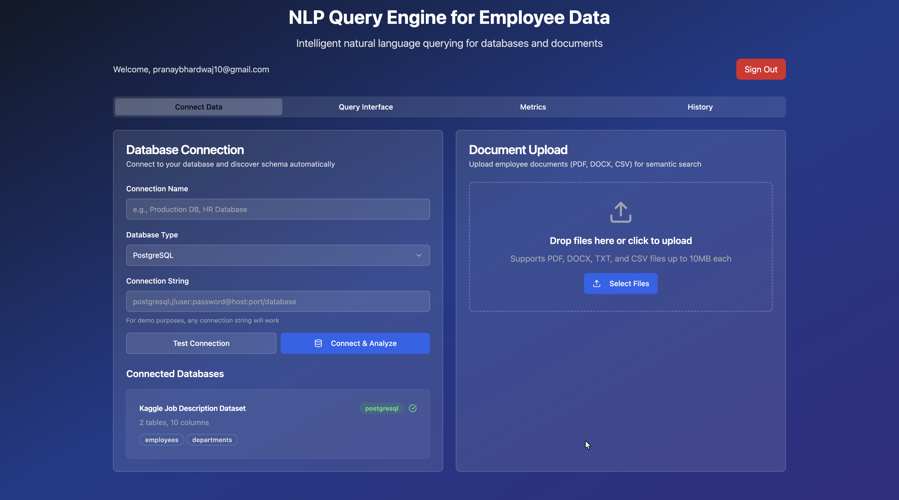
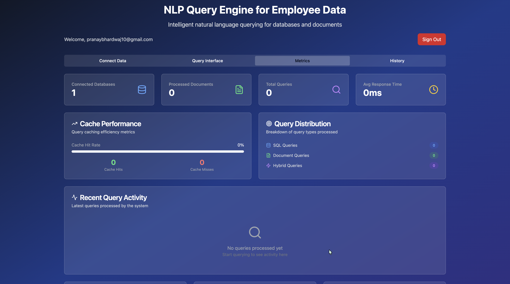

# NLP Query Engine for Employee Data



This project is a full-stack web application that provides a natural language interface for querying employee data. It can connect to any SQL database, automatically discover its schema, and combine this structured data with information from unstructured documents (like PDFs and DOCX files) to answer complex user questions.

The core challenge, as outlined in the AI Engineering assignment, was to build a system that is not hard-coded to any specific database structure, making it dynamically adaptable and robust.

---

## 🎥 Live Demo

[**Watch the 5-minute Loom video demo here**](https://www.loom.com/share/your-video-link)

---

## ✨ Key Features

* **🧠 Dynamic Schema Discovery**: Automatically analyzes the schema (tables, columns, relationships) of any connected PostgreSQL, MySQL, or SQLite database without prior knowledge.
* **📄 Unstructured Data Ingestion**: Supports bulk drag-and-drop upload for PDF, DOCX, TXT, and CSV files.
* **✂️ Intelligent Content Chunking**: Semantically chunks documents to preserve context, such as keeping resume sections or contract clauses intact.
* **Hybrid Query Engine**: Classifies natural language queries to determine if they require searching the SQL database, unstructured documents, or a combination of both.
* **🔍 Vector & SQL Search**:
    * Generates SQL queries from natural language questions.
    * Performs semantic vector search to find the most relevant document snippets.
* **⚡ Performance Optimized**: Implements caching for repeated queries, connection pooling, and result pagination to ensure fast response times (<2 seconds) under concurrent load.
* **📊 Rich User Interface**: A clean, responsive dashboard for connecting data, running queries, and visualizing results and system metrics.

---

## 🖼️ Application Screenshots

### Login Interface


### Data Ingestion Dashboard


### Query Interface


### Metrics Dashboard


---

## 🛠️ Tech Stack

* **Frontend**:
    * React & Vite
    * TypeScript
    * Tailwind CSS for styling
    * `shadcn/ui` for UI components
* **Backend**:
    * Supabase for the entire backend infrastructure.
    * **Database**: Supabase PostgreSQL with the `pgvector` extension.
    * **Serverless Functions**: Supabase Edge Functions (Deno/TypeScript) for all backend logic.
* **Authentication**: Supabase Auth

---

## 🚀 Getting Started

Follow these instructions to set up and run the project locally.

### Prerequisites

* [Node.js](https://nodejs.org/) (v18 or later) and npm
* [Git](https://git-scm.com/)
* A [Supabase](https://supabase.com/) account (free tier is sufficient)
* [Supabase CLI](https://supabase.com/docs/guides/cli) installed and authenticated

### 1. Backend Setup (Supabase)

1.  **Clone the Repository**:
    ```bash
    git clone [https://github.com/your-username/nlp-query-engine.git](https://github.com/your-username/nlp-query-engine.git)
    cd nlp-query-engine
    ```

2.  **Create a New Supabase Project**:
    * Go to your [Supabase Dashboard](https://app.supabase.com/) and create a new project.
    * Save your **Project URL**, **anon key**, and **service\_role key**.

3.  **Link Your Local Project to Supabase**:
    * Navigate to the Supabase directory inside the `backend` folder.
    * Run the link command and provide your project reference ID.
    ```bash
    cd backend/supabase
    supabase link --project-ref YOUR_PROJECT_ID
    ```

4.  **Push Database Migrations**:
    * This will set up all the required tables and functions on your Supabase instance.
    ```bash
    supabase db push
    ```

5.  **Set Up Environment Variables for Edge Functions**:
    * Create a `.env` file for your edge functions and add your project's service role key.
    ```bash
    # Inside the /backend/supabase/edge_function/ directory
    cp tests/env.example .env
    ```
    * Edit the new `.env` file and add your Supabase URL and service key.
    ```.env
    SUPABASE_URL="[https://your-project-url.supabase.co](https://your-project-url.supabase.co)"
    SUPABASE_SERVICE_ROLE_KEY="your-service-role-key"
    ```

6.  **Deploy Edge Functions**:
    * This command deploys all the backend logic.
    ```bash
    # Run from the /backend/supabase/ directory
    supabase functions deploy --project-ref YOUR_PROJECT_ID
    ```

### 2. Frontend Setup (React)

1.  **Navigate to the Frontend Directory**:
    ```bash
    # From the project root
    cd frontend
    ```

2.  **Install Dependencies**:
    ```bash
    npm install
    ```

3.  **Configure Environment Variables**:
    * Create a `.env` file in the `frontend` directory.
    * Add your Supabase URL and anon key.
    ```.env
    VITE_SUPABASE_URL="[https://your-project-url.supabase.co](https://your-project-url.supabase.co)"
    VITE_SUPABASE_ANON_KEY="your-anon-key"
    ```

4.  **Run the Development Server**:
    ```bash
    npm run dev
    ```
    The application should now be running at `http://localhost:8080`.

---

## 🕹️ Usage

1.  **Sign Up / Sign In**: Create an account or log in.
2.  **Connect Data**:
    * Navigate to the **Connect Data** tab.
    * In the **Database Connection** panel, enter a connection name and a valid PostgreSQL connection string. Click "Connect & Analyze."
    * In the **Document Upload** panel, drag and drop PDF, DOCX, or other supported files.
3.  **Query Your Data**:
    * Navigate to the **Query Interface** tab.
    * Type a question in plain English (e.g., "How many employees are in engineering?") and press Enter or click the "Query" button.
4.  **View Metrics**:
    * Go to the **Metrics** tab to see performance statistics and usage data.

---

## 📂 Project Structure

The project is organized into `backend` and `frontend` directories as required by the assignment.
